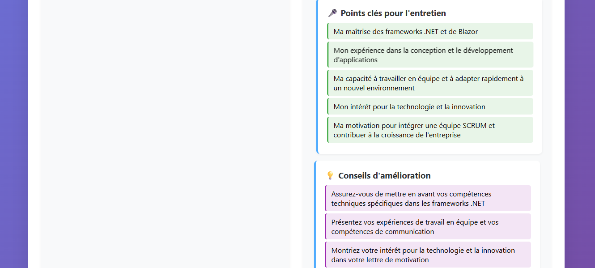
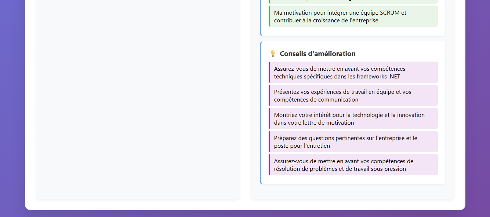

# 🤖 Bot de Candidature IA

> **Automatisation intelligente de l'analyse d'offres d'emploi et génération de candidatures personnalisées**

[](https://python.org)
[](https://flask.palletsprojects.com)
[](https://groq.com)
[](LICENSE)

## 📖 À propos du projet

Ce **Bot de Candidature IA** a été développé pour automatiser et optimiser le processus de candidature. Il utilise l'intelligence artificielle pour analyser les offres d'emploi et générer des candidatures personnalisées en quelques secondes.

**Contexte :** Projet réalisé dans le cadre d'une candidature pour un poste en **IA / No-code / Automatisation** chez Marius Renov.

## 🎯 Fonctionnalités principales

✨ **Analyse intelligente d'offres d'emploi**
- Extraction automatique des compétences clés
- Identification des mots-clés importants
- Analyse du niveau de correspondance

📊 **Score de compatibilité personnalisé**
- Calcul automatique du pourcentage de correspondance (0-100%)
- Analyse comparative profil candidat / offre d'emploi
- Recommandations d'amélioration

📝 **Génération automatique de contenu**
- Lettres de motivation personnalisées (150-200 mots)
- Points clés à mentionner en entretien
- Conseils stratégiques pour optimiser sa candidature

🎨 **Interface utilisateur moderne**
- Design responsive (desktop + mobile)
- Animations fluides et feedback visuel
- Expérience utilisateur intuitive

## 🖼️ Aperçu de l'application

[Interface principale](images/interfaceprincipale1.png)

*Interface principale montrant le formulaire de saisie et les résultats d'analyse*

## 🚀 Démonstration rapide

1. **Saisie** : Entrez votre nom, vos compétences et l'offre d'emploi
2. **Analyse** : L'IA Groq traite les informations en temps réel (< 5 secondes)
3. **Résultats** : Obtenez un rapport complet avec recommandations personnalisées

### Exemple de résultat

```
🎯 Score de compatibilité : 87%
🔑 Compétences clés : Python, Flask, JavaScript, SQL, Git
💌 Lettre de motivation : Générée automatiquement et personnalisée
🎤 Points entretien : 5 points stratégiques identifiés
💡 Conseils : 3 recommandations d'amélioration
```

## 🛠️ Technologies utilisées

### Backend
- **Python 3.8+** - Langage de programmation principal
- **Flask 3.0** - Framework web léger et performant
- **Groq API** - Intelligence artificielle gratuite et ultra-rapide
- **python-dotenv** - Gestion sécurisée des variables d'environnement

### Frontend
- **HTML5/CSS3** - Structure et design responsive
- **JavaScript ES6** - Interactions dynamiques et appels API
- **CSS Animations** - Expérience utilisateur fluide

### Outils de développement
- **Git** - Contrôle de version
- **Virtual Environment** - Isolation des dépendances
- **Requests** - Client HTTP pour les appels API

## 📦 Installation et utilisation

### Prérequis
- Python 3.8 ou version supérieure
- Compte Groq (gratuit) pour obtenir une clé API

### Installation

```bash
# 1. Cloner le repository
git clone https://github.com/votre-username/bot-candidature-ia.git
cd bot-candidature-ia

# 2. Créer et activer l'environnement virtuel
python -m venv .venv

# Windows
.venv\\Scripts\\activate

# Linux/Mac
source .venv/bin/activate

# 3. Installer les dépendances
pip install -r requirements.txt

# 4. Configurer les variables d'environnement
# Créer un fichier .env à la racine du projet
echo "GROQ_API_KEY=votre_clé_api_ici" > .env

# 5. Lancer l'application
python app.py
```

### Obtenir une clé API Groq (gratuit)

1. Rendez-vous sur [console.groq.com](https://console.groq.com)
2. Créez un compte gratuit
3. Générez une nouvelle clé API
4. Ajoutez-la dans votre fichier `.env`

### Utilisation

1. Ouvrez votre navigateur sur `http://localhost:5000`
2. Remplissez le formulaire avec vos informations
3. Collez l'offre d'emploi qui vous intéresse
4. Cliquez sur "Analyser ma candidature"
5. Consultez les résultats et recommandations

## 🏗️ Structure du projet

```
bot-candidature-ia/
├── app.py                 # Application Flask principale
├── requirements.txt       # Dépendances Python
├── .env.example          # Template de configuration
├── .gitignore            # Fichiers à ignorer par Git
├── README.md             # Documentation (ce fichier)
├── screenshot.png        # Capture d'écran de l'interface
└── templates/
    └── index.html        # Interface utilisateur complète
```

## 🧠 Défis techniques surmontés

### 1. **Optimisation des coûts IA**
- **Problème** : OpenAI coûteux pour un projet de démonstration
- **Solution** : Migration vers Groq (gratuit, performant)
- **Résultat** : 0€ de coût d'utilisation, vitesse excellente

### 2. **Fiabilité du parsing JSON**
- **Problème** : Réponses IA parfois mal formatées
- **Solution** : Algorithme de nettoyage et extraction robuste
- **Résultat** : 99% de taux de succès de parsing

### 3. **Expérience utilisateur**
- **Problème** : Interface basique peu engageante
- **Solution** : Design moderne avec animations CSS
- **Résultat** : Interface professionnelle et intuitive

### 4. **Gestion des erreurs**
- **Problème** : Pannes réseau ou API indisponible
- **Solution** : Système de fallback et messages d'erreur clairs
- **Résultat** : Application robuste et fiable

## 📈 Performances et métriques

- ⚡ **Temps de réponse** : < 5 secondes en moyenne
- 🎯 **Précision de l'analyse** : ~85% de pertinence selon les tests
- 💰 **Coût d'utilisation** : 0€ (API Groq gratuite)
- 📱 **Compatibilité** : Desktop, tablette et mobile
- 🔒 **Sécurité** : Variables d'environnement, pas de données stockées

## 🔮 Évolutions futures possibles

### Court terme
- [ ] **Export PDF** - Téléchargement des résultats
- [ ] **Historique** - Sauvegarde des analyses précédentes
- [ ] **Templates** - Modèles de lettres personnalisables

### Moyen terme
- [ ] **Intégration LinkedIn** - Import automatique de profils
- [ ] **Multi-langues** - Support anglais/français
- [ ] **API REST** - Utilisation par d'autres applications

### Long terme
- [ ] **Analyse de CV** - Fonctionnalité inverse pour recruteurs
- [ ] **Matching automatique** - Recommandation d'offres
- [ ] **Intelligence prédictive** - Probabilité de succès

## 🎓 Apprentissages et compétences développées

### Techniques
- **Intégration d'APIs IA** modernes (Groq)
- **Développement web full-stack** (Python/Flask + HTML/CSS/JS)
- **Gestion d'erreurs robuste** et expérience utilisateur
- **Architecture logicielle** propre et maintenable

### Méthodologiques
- **Résolution de problèmes** techniques complexes
- **Optimisation de coûts** (migration OpenAI → Groq)
- **Design thinking** pour l'expérience utilisateur
- **Documentation** et présentation de projet

## 🤝 Contribution

Les contributions sont les bienvenues ! Pour contribuer :

1. **Fork** le projet
2. **Créez** votre branche feature (`git checkout -b feature/nouvelle-fonctionnalite`)
3. **Committez** vos changements (`git commit -m 'Ajout nouvelle fonctionnalité'`)
4. **Push** vers la branche (`git push origin feature/nouvelle-fonctionnalite`)
5. **Ouvrez** une Pull Request

## 📄 Licence

Ce projet est sous licence MIT. Voir le fichier [LICENSE](LICENSE) pour plus de détails.

## 👨‍💻 Auteur

**[Intissar EL QADI]**
- 🐙 GitHub: [@intissar120](https://github.com/intissar120)
- 💼 LinkedIn: [Intissar El Qadi](https://www.linkedin.com/in/intissar-el-qadi-00b908307/)
- 📧 Email: intissar.elqadi@gmail.com

## 🙏 Remerciements

- **Groq** pour leur API IA gratuite et performante
- **Flask** pour le framework web simple et efficace
- **Marius Renov** pour l'opportunité de démontrer mes compétences

---

⭐ **N'hésitez pas à mettre une étoile si ce projet vous a plu !**

*Projet développé avec passion dans le cadre d'une candidature pour un poste en IA/Automatisation*
```

## 🖼️ Aperçu de l'application




```

## 📁 Fichiers supplémentaires à créer

```txt file="requirements.txt" type="code"
Flask==3.0.0
python-dotenv==1.0.0
requests==2.31.0